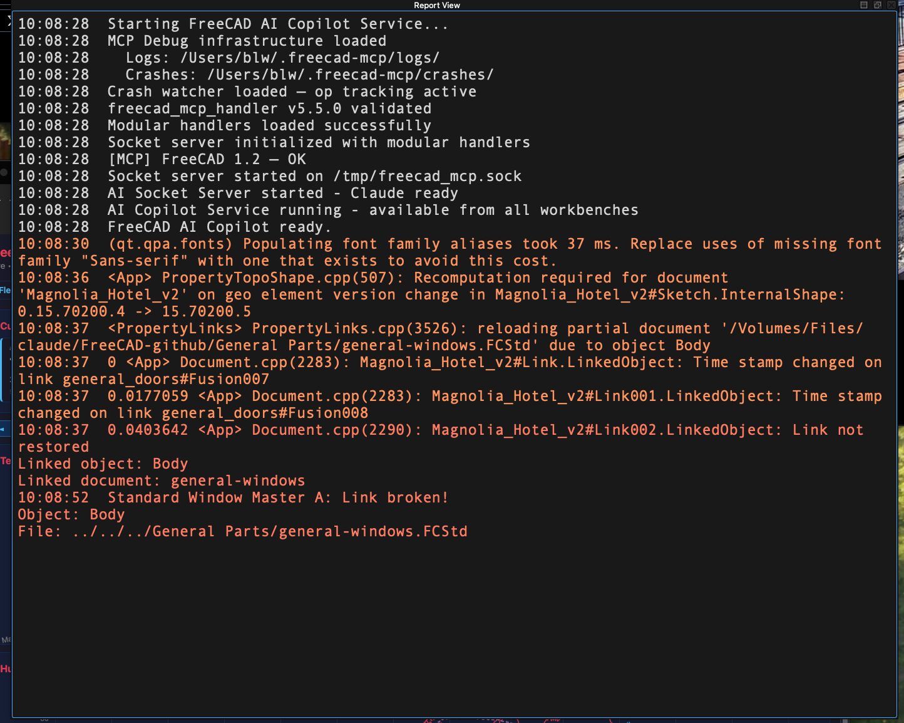
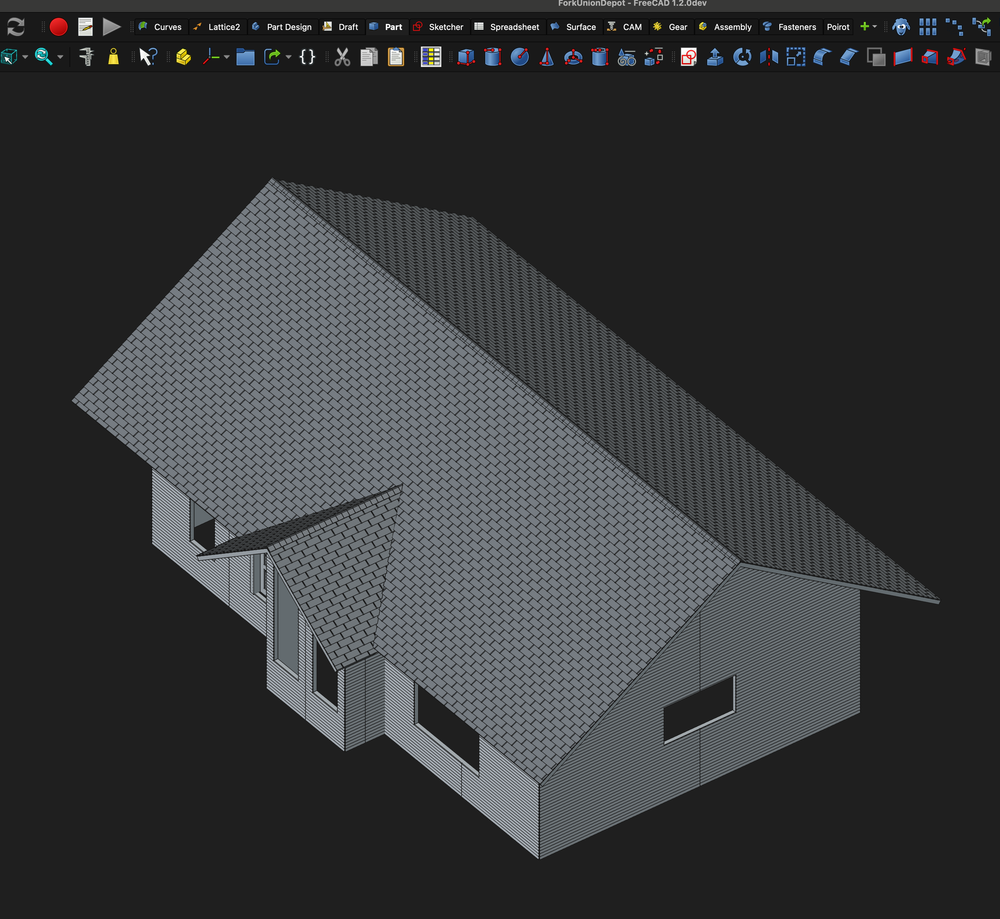
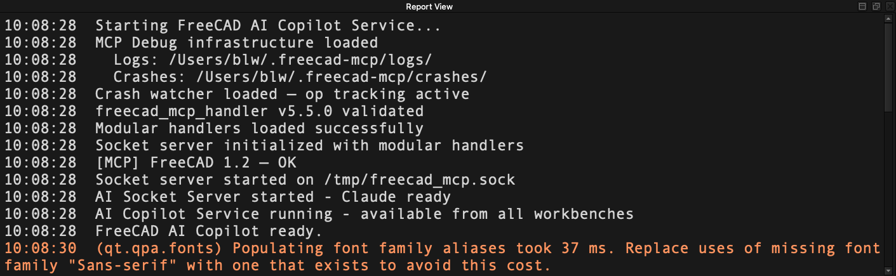

# freecad-mcp

[](https://github.com/blwfish/freecad-mcp/actions/workflows/tests.yml)
[](https://github.com/blwfish/freecad-mcp/actions/workflows/integration-tests.yml)
[](LICENSE)

This tool enables your AI agent to use [FreeCAD](https://www.freecad.org/) — the open-source parametric 3D CAD modeler — to design parts, generate CNC toolpaths, and produce manufacturing-ready files for you.

> **FreeCAD version support:** All tools except CAM are supported on FreeCAD 1.1.x (current stable). CAM toolpath generation requires FreeCAD 1.2-dev — the Path workbench API changed incompatibly between 1.1 and 1.2. This project tracks 1.2-dev.

## What This Does

You describe what you need — "design a mounting bracket with these dimensions" or "generate G-code for this part" — and your AI agent does the rest: creating parametric sketches, padding and pocketing features, adding fillets, setting up CAM jobs, and exporting files. All using the same FreeCAD that engineers and makers use, with 33 tools covering parametric design, CNC toolpath generation, and mesh operations. See [TOOLS.md](TOOLS.md) for the full tool reference.

If you already use FreeCAD, this gives you a thinking partner — for working faster, for co-designing things that would take hours to build by hand, for untangling the cryptic error messages that FreeCAD is so good at generating, and for hunting down the subtle, knotty modeling problems that are nearly impossible to find alone.

## See It In Action

**Debugging a broken external reference** — a link FreeCAD can't restore, an error
message that seems to contradict what you know about your own model, and a one-line fix
found by reading the file directly.

[](docs/scenario-external-refs.md)

[Full story →](docs/scenario-external-refs.md)

---

**Designing a shingles generator** — several sessions of back-and-forth to design a
parametric generator that tiles any roof surface from a spreadsheet of parameters.

[](docs/scenario-shingles.md)

[Full story →](docs/scenario-shingles.md)

---

## What You Can Ask Your Agent To Do

- **Design a 3D part** — "I need a mounting plate, 100x60mm, with four M3 mounting holes and rounded corners"
- **Modify an existing design** — "Add a 2mm fillet to all the edges and make it 5mm thicker"
- **Generate CNC toolpaths** — "Create a pocket operation for this part using a 6mm end mill"
- **Export for manufacturing** — "Export this as STEP and generate the G-code for my CNC router"
- **Work with meshes** — "Import this STL, convert it to a solid, and add mounting features"
- **Diagnose problems** — "I just tried to pad this sketch and got a weird result, what went wrong?" The agent can inspect the model state, check sketch constraints, and explain what FreeCAD is telling you.
- **Build automation** — "Write me a script that generates a parametric enclosure from a spreadsheet of dimensions" or "Create a macro that imports DXF profiles and extrudes them to different heights"
- **Check your work** — "Does this model have any geometry errors?", "Will this part have thin walls that might fail in printing?", or "Are any of these parts interfering with each other?"

## Getting Started

Tell your AI agent:

> Go to https://github.com/blwfish/freecad-mcp and read the AGENT-INSTALL.md file. Follow the instructions to install and configure the FreeCAD MCP server on this machine.

Your agent will handle the rest — installing prerequisites, cloning the repo, setting up the FreeCAD addon, and registering itself. Once setup is complete, you can ask your agent to design parts.

### Verifying your installation

Once FreeCAD is running with the AICopilot workbench loaded, open the Report View (menu: View → Panels → Report View). You should see something like this:



A few things worth knowing about this output:

- **AI Copilot Service starting** — confirms the AICopilot workbench loaded correctly. If you don't see this, the addon isn't installed or FreeCAD isn't finding it.
- **Debug/crash infrastructure loaded** — active instrumentation is running. If something goes wrong mid-operation, logs and crash reports are captured automatically.
- **Socket server started / Claude ready** — the bridge is listening. This is the line that means your AI agent can connect.
- **Font alias warning** (in orange) — harmless Qt noise that appears on most macOS systems regardless of what you're doing. Not a problem.

## Background

I built this for myself and use it daily for real work — designing parts, generating toolpaths, and printing them on my 3D printers or cutting them on my CNC router. This is not a demo or a proof of concept. It's a production tool that I rely on.

I use Claude Code on a Mac. Other platforms *should* work — the code handles macOS, Windows, and Linux — but are less tested. PRs for other agents and platforms will be considered.

If you hit a bug, [open an issue](https://github.com/blwfish/freecad-mcp/issues/new) — silent failures don't help anyone. Agents won't tell you when something's wrong; they'll just fail their task and you'll blame Claude. (GitHub Discussions are intentionally off — issues are the single channel. See [CONTRIBUTING.md](CONTRIBUTING.md) for what makes a useful report.)

### For Developers

```bash
# Unit tests (593 tests, no FreeCAD required)
python3 -m pytest tests/unit/

# Integration tests (91 tests, requires running FreeCAD with AICopilot loaded)
python3 -m pytest tests/integration/

# All tests with coverage
python3 -m pytest --cov=AICopilot
```

#### Prompt Caching and Direct Claude API Calls

**For Claude users: the easiest and cheapest approach is to use Claude Code, the web interface, or the CLI tool directly.** These platforms automatically handle prompt caching and cost optimization — you don't need to think about it. If you're just using this MCP to design parts in FreeCAD, use Claude Code. Stop reading this section.

If you're building applications or integrations that make direct calls to the Claude API (using the Anthropic SDK), **you must understand prompt caching**. The Claude desktop app, web interface, and CLI tools automatically handle caching of file context and tool references — you don't see this optimization, but it reduces latency and cost for repeated queries over the same context.

When you make direct API calls, caching must be managed explicitly. The MCP server itself doesn't make API calls, but if you build integrations or extensions that do:

- **Read the Anthropic SDK documentation** on prompt caching before deploying
- Understand cache TTL (typically 5 minutes) and cost implications (20% of input tokens)
- Be aware that cache keys include model, system prompt, and exact token boundaries — small variations bust the cache
- Consider cache-busting risks if your context is frequently updated (like document state snapshots)

Similarly, if you integrate other MCP servers or agents into your workflow, they may have analogous considerations that are not documented in their README. Check their documentation or source for caching behavior, async job handling, and token limits — don't assume they work like Claude Code.


The test suite covers the handler dispatch layer, base infrastructure, and document operations via unit tests, plus end-to-end coverage of Part, PartDesign, Sketch, Draft, Boolean, Transform, Measurement, and CAM workflows via integration tests against a live FreeCAD instance. CI runs both suites on every push.

#### Built-in Diagnostics

The project includes debugging infrastructure that you will want to know about if you're developing or troubleshooting:

- **`get_debug_logs`** — structured operation logs with before/after state snapshots, written to `/tmp/freecad_mcp_debug/`. Every tool call records what changed.
- **`get_report_view`** — reads FreeCAD's Report View panel (the console output most users never look at). Supports filtering and tail. This is often where FreeCAD tells you what actually went wrong.
- **`manage_connection`** — bridge-side diagnostics that work even when FreeCAD is down: connection health, recovery file validation, and clearing corrupt `.FCStd` recovery files that cause crash loops.
- **Crash watcher** — writes the current operation to `/tmp/freecad_mcp_last_op.json` before each dispatch. If FreeCAD crashes mid-operation, this file survives and the bridge reports what was running when it died.
- **Health monitor** — tracks operation timing, error rates, and crash history. Detects patterns like "this operation crashes every time" before you waste an afternoon on it.
- **`run_inspector`** — runs design-rule checks against the live document (via the FC-tools sibling repo).
- **`macro_operations`** — list, read, and run macros from the user's FreeCAD macro directory (`App.getUserMacroDir()`). Lets the agent leverage an existing library of automation scripts instead of regenerating common operations from scratch.
- **`api_introspection`** — live signature/docstring lookup against FreeCAD's running module tree, plus fuzzy search across FreeCAD core + workbenches. Eliminates the wrong-signature class of `execute_python` failures. Search ranking improves over time as the agent records which results led to successful API calls (`record_useful` action; feedback persisted to `~/.freecad-mcp/introspection_feedback.json`).

These tools exist because FreeCAD's error reporting is often cryptic and OCCT kernel crashes leave no trace. When something goes wrong, the agent can pull debug logs, read the report view, and check crash history — usually enough to diagnose the problem without manual investigation.

See [AGENT-INSTALL.md](AGENT-INSTALL.md) for full technical details, architecture, contributing guidelines, and how to add new tools.

## Security

This MCP server grants your AI agent full access to FreeCAD's Python environment, including the ability to run arbitrary code via `execute_python`. This is by design — it's what makes the tool useful. However, you should be aware of the implications:

- **Arbitrary code execution**: The `execute_python` tool can run any Python code inside FreeCAD, with full access to the filesystem, network, and OS. This is equivalent to giving your AI agent a shell.
- **Unrestricted file access**: File import/export operations accept arbitrary filesystem paths. The agent can read and write any file your user account can access.
- **Local-only transport**: The MCP bridge communicates via a Unix domain socket (TCP localhost on Windows). It is not exposed to the network.
- **No authentication**: Any process running as your user can connect to the socket. On a single-user workstation this is fine; on shared systems, be aware of this.

**This tool is intended for local development use on a single-user machine.** Do not expose it to untrusted networks or users.

## License

LGPL-2.1-or-later

