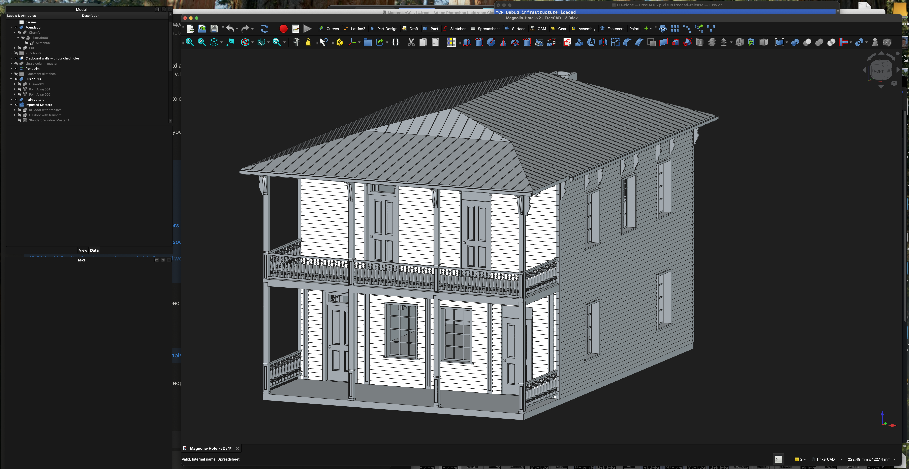
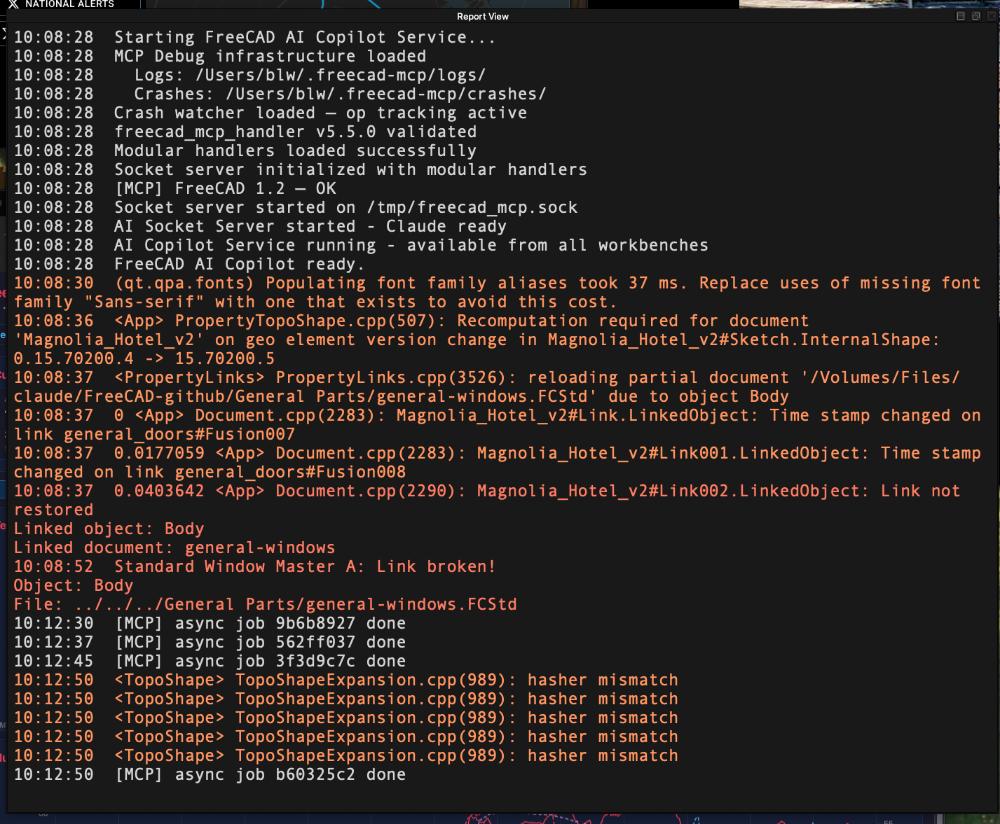

# Scenario: Broken External Reference

*A real session. The model is a multi-story building built in FreeCAD using Part workbench,
with windows and doors linked in from separate files.*

---



**User:** I just opened this model after a couple of weeks and it's broken. The report view
says it's due to "Body" — but I built this with Part, not PartDesign, and I don't have a
Body at all. What is it trying to tell me?


**Claude:** The error isn't about your model — it's about an external file. `Link002`
("Standard Window Master A") was saved pointing to an object named `Body` inside
`general-windows.FCStd`. Let me see what's actually in that file.

*(checks the document — it loaded as a partial doc with 0 objects accessible, so reads
the FCStd archive directly)*

There's no `Body` in that file. 21 objects, all Part workbench: Sketches, Extrudes,
Sweeps, a Mirror, and a final `Fusion`. No PartDesign anywhere. Your door links both
correctly point to `Part::MultiFuse` objects. This link was pointing to a name that
doesn't exist.

The window file was probably rebuilt at some point — Part replacing an earlier PartDesign
version — and the link in the hotel model still remembered the old name. One line to fix it:

```python
lnk.LinkedObject = gw.getObject('Fusion')
doc.recompute()
```

**User:** Great, that cleared it. Now there are "hasher mismatch" messages — five of them.
What do they mean? Do I care?



**Claude:** You don't care. When FreeCAD reconnected the link and recomputed the window
clones, it copied element names from `general-windows` into the hotel document's element
map. The two documents use different hashers — internal ID generators for stable face and
edge naming. FreeCAD warns and drops the hash tags from those element names, but the
geometry is correct.

(I looked at the source code that generated it — FreeCAD's `TopoShapeExpansion.cpp` —
the warning fires when shapes from different documents get merged and their string ID
hashers don't match; FreeCAD drops the hash tags and continues rather than failing.)

This would matter if something downstream referenced specific faces or edges of the window
geometry — a fillet on the frame, a sketch attached to the sill. Nothing in this model
does that. The windows are linked in as solid blobs; their internal topology is invisible
to everything else. It's noise.
